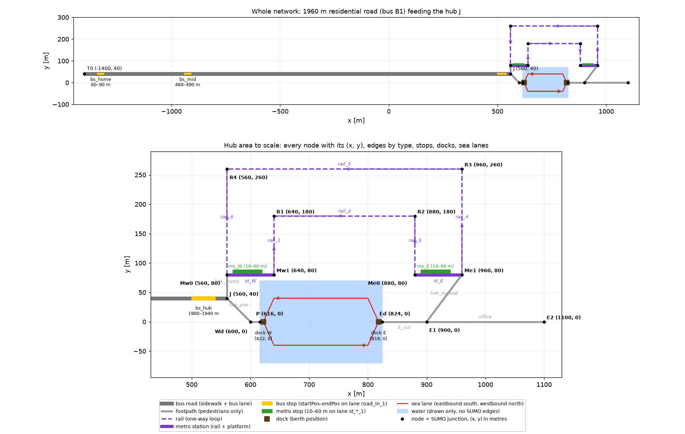
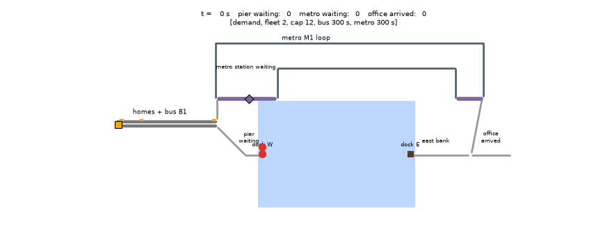

# Integrated Land–Water Mobility Simulation
A compact, reproducible prototype of an **integrated land–water simulation platform** for passenger transport by autonomous surface vessels (ASVs). A *traveller model* (binary logit between a vessel chain and a metro chain) and an *operator model* (dispatch of a small ASV fleet) are coupled to the open-source simulator SUMO.

> Note: The code in this repo were developed with the assistance of an AI coding tool. All generated code has been reviewed, tested and is maintained by the author, who takes full responsibility for its correctness and for the results reported here.
---

## 1. Study scenario

The synthetic study case is a morning peak in a river-side town. Three hundred commuters leave a residential area on the west bank between 0 and 40 min and travel to an office district on the east bank. All of them take feeder bus **B1** to the river-side hub, where the river can be crossed in two ways:

* **Bus → ASV → Walk** — walk 57 m to the pier, board an autonomous vessel (fleet of 1–3, 12 seats each, 248 m crossing ≈ 87 s), walk 76 m from the east dock to the office;
* **Bus → Metro → Walk** — walk 40 m to station *st_W*, ride metro **M1** over the rail bridge to *st_E*, walk 100 m to the office.

The vessel service is the object of study; the metro is the incumbent alternative against which it competes. Fleet size, dispatch policy and metro headway are the scenario variables (Section 6).


*Figure 1. Compiled network. Top: whole network with the 1 960 m residential road and three bus stops. Bottom: hub area to scale with node coordinates, edge types, stops, docks and sea lanes.*

Homes lie 1.3–1.9 km from the hub, so the bus is the rational access mode. B1 runs every 300 s with timetable offsets +20/+60/+190 s; M1 runs every 300 s (120 s in sensitivity runs) with offsets +30/+100 s. The river is 208 m wide; the vessels use separate eastbound and westbound lanes; the rail loop is one-directional.

---

## 2. Traveller demand modelling

**Demand.** $N = 300$ travellers depart at $t_i \sim \mathcal U(0, 2400\,\text{s})$ (a Poisson process conditional on $N$), from homes uniform along the residential road, each with an impatience coefficient
$\eta_i \sim \text{LogNormal}(0, 0.4)$.

**Expected times.** SUMO's intermodal router (`findIntermodalRoute`) returns walking, in-vehicle and timetable waiting times of both chains. For the vessel chain the platform adds what SUMO cannot know: the operator's published expected wait $\hat w$, the crossing time from the sea-lane geometry, and the east-bank walk.

**Choice.** Each chain $j$ has utility

$$
V_{ij} = \text{ASC}_j - \beta_{ivt} T^{ivt}_{ij} - \beta_{wait}\,\eta_i\,T^{wait}_{ij} - \beta_{walk} T^{walk}_{ij} - \beta_{fare} F_j,
\qquad
P_i(\text{ASV}) = \frac{1}{1 + e^{\,V_{i,\text{Metro}} - V_{i,\text{ASV}}}} .
$$

| Parameter | Value | Meaning |
|---|---|---|
| $\beta_{ivt}$ | 1/60 s⁻¹ | one in-vehicle minute = one utility unit |
| $\beta_{wait}$, $\beta_{walk}$ | 1.6/60, 1.4/60 s⁻¹ | out-of-vehicle time valued above in-vehicle time (Wardman, 2004) |
| $\beta_{fare}$ | 0.4 €⁻¹ | 1 € ≈ 24 s in-vehicle |
| $F_{\text{ASV}} = F_{\text{Metro}}$ | 2 € | equal fares cancel out |
| $\text{ASC}_{\text{ASV}}$ | 0 (`--asc-asv`) | constant of the vessel chain |

The chosen chain becomes a SUMO person plan; the vessel leg is an open-ended waiting stage on the pier.

**Feedback.** $\hat w$ is an exponential moving average of realised boarding waits,
$\hat w \leftarrow \hat w + 0.3\,(w - \hat w)$, acting as a real-time information service. Every $\Delta t = 30$ s the departing travellers receive the current $\hat w$ and choose, then the operator dispatches. Long waits raise $\hat w$, cut $P(\text{ASV})$ for the next batches, shorten the queue and lower $\hat w$ again. The loop is steep: for a typical traveller $\hat w = 60$ s gives $P(\text{ASV}) \approx 0.60$, $\hat w = 180$ s gives $\approx 0.06$.

---

## 3. ASV operation modelling

**Vessels.** Point masses following waypoints at $u_c = 3$ m/s, speed bounded by $\sqrt{2ad}$ ($a = 0.5$ m/s², $d$ = remaining distance) so they arrive at rest. Capacity 12, minimum dwell 20 s, states *docked* / *sailing*. Only the vessel docked longest may board.

**Timetable policy.** Depart the west dock at fixed slots (headway 300 / 150 / 100 s for 1 / 2 / 3 vessels) whether full or empty; return from the east dock after the minimum dwell. The conventional ferry benchmark.

**Demand-responsive policy.** Depart when full or when the first traveller has waited $w_{max} = 120$ s. An idle vessel repositions to the dock with the longest queue, else to the dock with the higher prior demand (in the morning peak: straight back to the west dock).

---

## 4. Case Study: How the two policies effect results

Both runs use two vessels of 12 passengers, a metro every 300 s and the same 300 travellers (seed 1); only the policy differs.


*Figure 3. Timetable policy (departure every 150 s). Left: pier queue (blue) and published expected wait (red dashed). Centre: door-to-door time by chain. Right: vessel tracks.*


*Figure 4. Demand-responsive policy (depart when full or after 120 s of waiting; idle vessels return to the west dock). Same panels.*

**Left panels — queue and published wait**

* Queue peaks (34–36 travellers around 1 200–1 500 s) are alike in both runs: each bus unloads more travellers at once
  than one vessel holds, so the peaks come from the feeder bus, not the policy.
* Timetable: the queue decays in a sawtooth as each slot clears at most one vessel load; the published wait climbs
  above 300 s.
* On-demand: a vessel leaves as soon as it is full and the second, returned empty, follows; the published wait
  stays below 230 s and the feedback oscillation is damped.
* After demand ends (2 400 s) the published wait settles near 40 s under the timetable but near 100 s under the
  on-demand policy, which waits for its 120 s trigger before departing: at low demand the trigger, not the
  fleet, sets the floor.

**Centre panels — door-to-door time**

* On-demand: 61 % vessel share, mean pier wait 120 s; the vessel chain's distribution overlaps the metro's.
* Timetable: 55 % share, mean pier wait 151 s; the vessel distribution is wider and shifted to longer times, because
  slot waiting adds delay and variance.

**Right panels — fleet efficiency**

* Timetable: 24 sailings per vessel, 68 % of the distance sailed empty — it departs on schedule whether or not anyone
  waits.
* On-demand: 18 sailings per vessel, 48 % empty — one empty return per loaded crossing, the structural minimum
  in a one-directional peak.
---

## 5. Scenario comparison and conclusions

Same demand (300 travellers, 40 min, seed 1), bus every 300 s, metro every 300 s; fleet size and policy varied.

| Vessels | Policy | ASV share | Mean pier wait | Door-to-door ASV / Metro | Sailings (empty) | Load factor |
|---|---|---|---|---|---|---|
| 1 | demand-responsive | 35 % | 547 s | 1 229 / 767 s | 18 (9) | 48 % |
| 1 | timetable, 300 s | 43 % | 648 s | 1 323 / 768 s | 24 (14) | 42 % |
| 2 | demand-responsive | 61 % | 120 s | 795 / 768 s | 36 (18) | 42 % |
| 2 | timetable, 150 s | 55 % | 151 s | 835 / 766 s | 47 (32) | 29 % |
| 3 | demand-responsive | 79 % | 48 s | 740 / 747 s | 48 (24) | 41 % |
| 3 | timetable, 100 s | 64 % | 106 s | 795 / 752 s | 69 (49) | 23 % |

*Table 1. Metro every 300 s. All twelve runs, including metro every 120 s: `results/compare.csv`, `results/compare.png`.*

1. **Supply and demand interact.** One vessel saturates: the published wait reaches 9–14 min and about 60 % of travellers
   switch to the metro. Three vessels bring the wait below one minute and the chains reach equilibrium (740 vs 747 s
   door-to-door) with a 79 % vessel share.
2. **Demand-responsive dispatch dominates the timetable** at equal fleet size: shorter waits, higher share and load
   factor, fewer empty sailings. Empty distance cannot fall below ≈ 50 % in this one-directional peak.
3. **Transfer coordination outweighs frequency.** With a metro every 120 s the vessel share is *higher* than with
   300 s: the bus reaches the hub at +190 s, the walk takes 100 s, and the 300 s train leaves 40 s later whereas the
   120 s train leaves 100 s later.

---

## 6. Reproduction

```bash
source ../.venv/bin/activate                  # SUMO 1.27.1, numpy, matplotlib
python build_network.py && python plot_network.py          # network + Figure 1
python run.py                                 # 2 vessels, demand-responsive, metro 300 s
python run.py --fleet 2 --policy timetable --headway 150   # Figure 3
python run.py --gif 1400 --end 1400           # Figure 2
for f in 1 2 3; do python run.py --fleet $f --policy demand; \
                    python run.py --fleet $f --policy timetable --headway $((300 / f)); done
python compare.py                             # Table 1
```

Options: `--fleet --capacity --cruise`, `--policy --headway --max-wait`, `--bus-period --metro-period`,
`--travellers --demand-end --asc-asv`, `--dt --seed --gui --screenshot --gif`.

| File | Content |
|---|---|
| `layout.py` | Geometry, names, dock positions, sea lanes, paths |
| `build_network.py`, `plot_network.py` | Network, stops, timetables, config; Figure 1 |
| `travellers.py` | Demand, expected times, logit, tour creation |
| `asv.py`, `asv_operator.py` | Vessel model; policies and `Operator` |
| `run.py`, `compare.py`, `test_run_gif.py` | Coupled loop, KPIs, figures, GIF; cross-run comparison; unit tests |

English docstrings describe interfaces; Chinese comments explain the logic; `GUIDE_zh.md` is a line-by-line commentary.

## References

* Zhou, Z. et al. (2026). Simulation-based assessment of operational ridesharing strategies for shared autonomous
  vehicles in large-scale networks. *European Transport Research Review*, 18, 28. https://doi.org/10.1186/s12544-026-00787-4
* Lopez, P. A. et al. (2018). Microscopic traffic simulation using SUMO. *IEEE ITSC*. https://sumo.dlr.de
* Wardman, M. (2004). Public transport values of time. *Transport Policy*, 11(4), 363–377.


