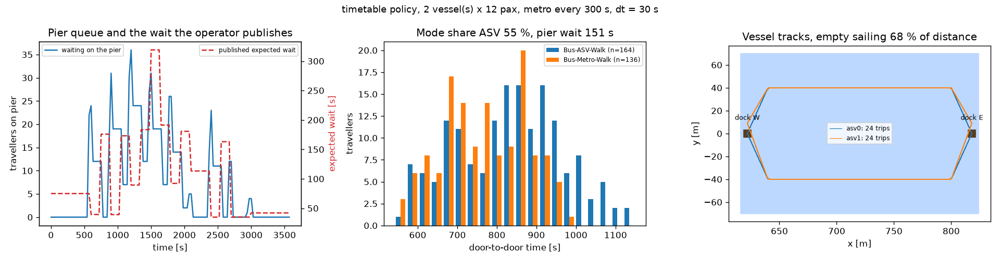
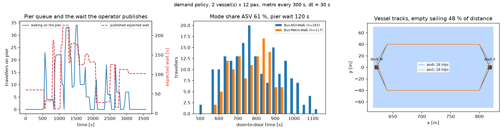

# Integrated Land–Water Mobility Simulation
A compact, reproducible prototype of an **integrated land–water simulation platform** for passenger transport by autonomous surface vessels (ASVs). A *traveller model* (binary logit between a vessel chain and a metro chain) and an *operator model* (dispatch of a small ASV fleet) are coupled to the open-source simulator SUMO.

---

## 1. Study scenario

The synthetic study case is a morning peak in a river-side town. Three hundred commuters leave a residential area on the west bank between 0 and 40 min and travel to an office district on the east bank. All of them take feeder bus **B1** to the river-side hub, where the river can be crossed in two ways:

* **Bus → ASV → Walk** — walk 57 m to the pier, board an autonomous vessel (fleet of 1–3, 12 seats each, 248 m crossing ≈ 87 s), walk 76 m from the east dock to the office;
* **Bus → Metro → Walk** — walk 40 m to station *st_W*, ride metro **M1** over the rail bridge to *st_E*, walk 100 m to the office.

The vessel service is the object of study; the metro is the incumbent alternative against which it competes. Fleet size, dispatch policy and metro headway are the scenario variables (Section 6).

*Figure 1. Compiled network. Top: whole network with the 1 960 m residential road and three bus stops. Bottom: hub area to scale with node coordinates, edge types, stops, docks and sea lanes.*

Homes lie 1.3–1.9 km from the hub, so the bus is the rational access mode. B1 runs every 300 s with timetable offsets +20/+60/+190 s; M1 runs every 300 s (120 s in sensitivity runs) with offsets +30/+100 s. The river is 208 m wide; the vessels use separate eastbound and westbound lanes; the rail loop is one-directional.

---

## 2. Traveller demand modelling

**Demand.** $N = 300$ travellers depart at $t_i \sim \mathcal U(0, 2400\,\text{s})$ (a Poisson process conditional on $N$), from homes uniform along the residential road, each with an impatience coefficient
$\eta_i \sim \text{LogNormal}(0, 0.4)$.

**Expected times.** SUMO's intermodal router (`findIntermodalRoute`) returns walking, in-vehicle and timetable waiting times of both chains. For the vessel chain the platform adds what SUMO cannot know: the operator's published expected wait $\hat w$, the crossing time from the sea-lane geometry, and the east-bank walk.

**Choice.** Each chain $j$ has utility

$$
V_{ij} = \text{ASC}_j - \beta_{ivt} T^{ivt}_{ij} - \beta_{wait}\,\eta_i\,T^{wait}_{ij} - \beta_{walk} T^{walk}_{ij} - \beta_{fare} F_j,
\qquad
P_i(\text{ASV}) = \frac{1}{1 + e^{\,V_{i,\text{Metro}} - V_{i,\text{ASV}}}} .
$$

| Parameter | Value | Meaning |
|---|---|---|
| $\beta_{ivt}$ | 1/60 s⁻¹ | one in-vehicle minute = one utility unit |
| $\beta_{wait}$, $\beta_{walk}$ | 1.6/60, 1.4/60 s⁻¹ | out-of-vehicle time valued above in-vehicle time (Wardman, 2004) |
| $\beta_{fare}$ | 0.4 €⁻¹ | 1 € ≈ 24 s in-vehicle |
| $F_{\text{ASV}} = F_{\text{Metro}}$ | 2 € | equal fares cancel out |
| $\text{ASC}_{\text{ASV}}$ | 0 (`--asc-asv`) | constant of the vessel chain |

The chosen chain becomes a SUMO person plan; the vessel leg is an open-ended waiting stage on the pier.

**Feedback.** $\hat w$ is an exponential moving average of realised boarding waits,
$\hat w \leftarrow \hat w + 0.3\,(w - \hat w)$, acting as a real-time information service. Every $\Delta t = 30$ s the departing travellers receive the current $\hat w$ and choose, then the operator dispatches. Long waits raise $\hat w$, cut $P(\text{ASV})$ for the next batches, shorten the queue and lower $\hat w$ again. The loop is steep: for a typical traveller $\hat w = 60$ s gives $P(\text{ASV}) \approx 0.60$, $\hat w = 180$ s gives $\approx 0.06$.

---

## 3. ASV operation modelling

**Vessels.** Point masses following waypoints at $u_c = 3$ m/s, speed bounded by $\sqrt{2ad}$ ($a = 0.5$ m/s², $d$ = remaining distance) so they arrive at rest. Capacity 12, minimum dwell 20 s, states *docked* / *sailing*. Only the vessel docked longest may board.

**Timetable policy.** Depart the west dock at fixed slots (headway 300 / 150 / 100 s for 1 / 2 / 3 vessels) whether full or empty; return from the east dock after the minimum dwell. The conventional ferry benchmark.

**Demand-responsive policy.** Depart when full or when the first traveller has waited $w_{max} = 120$ s. An idle vessel repositions to the dock with the longest queue, else to the dock with the higher prior demand (in the morning peak: straight back to the west dock).

---

## 4. Case Study: How the two policies effect results

Both runs use two vessels of 12 passengers, a metro every 300 s and the same 300 travellers (seed 1); only the policy differs.

*Figure 3. Timetable policy (departure every 150 s). Left: pier queue (blue) and published expected wait (red dashed). Centre: door-to-door time by chain. Right: vessel tracks.*

*Figure 4. Demand-responsive policy (depart when full or after 120 s of waiting; idle vessels return to the west dock). Same panels.*

| | Timetable (Fig. 3) | Demand-responsive (Fig. 4) |
|---|---|---|
| ASV share | 55 % | 61 % |
| Mean / max pier wait | 151 s / 333 s | 120 s / 358 s |
| Door-to-door ASV / Metro | 835 / 766 s | 795 / 768 s |
| Sailings (empty) | 47 (32) | 36 (18) |
| Load factor | 29 % | 42 % |
| Distance sailed empty | 68 % | 48 % |
| Published wait, range | 35–319 s | 10–226 s |

**Left panels — queue and published wait**

* Queue peaks (34–36 travellers at 1 200–1 500 s) are the same in both runs: a bus unloads about 25 travellers at once, more than one vessel holds, so the peaks come from the feeder bus, not the policy.
* Timetable: at most 12 travellers cleared every 150 s regardless of demand → sawtooth queue, published wait above 300 s.
* Demand-responsive: a vessel leaves as soon as it is full and the second, returned empty, follows → published wait below 230 s, feedback oscillation damped.
* After demand ends (2 400 s) the timetable keeps sailing empty slots; the demand-responsive vessels wait for the 120 s trigger, so their published wait settles near 100 s rather than 40 s — at low demand $w_{max}$, not the fleet, sets the floor.

**Centre panels — door-to-door time**

* Demand-responsive: 61 % vessel share; vessel chain within 30 s of the metro (795 vs 768 s).
* Timetable: 55 % share; vessel distribution wider and 70 s slower than the metro, because slot waiting adds delay and variance.

**Right panels — fleet efficiency**

* Timetable: 47 sailings, 32 empty (68 % of distance) — it departs on schedule whether or not anyone waits.
* Demand-responsive: 36 sailings, exactly 18 empty (48 %) — one empty return per loaded crossing, the structural minimum in a one-directional peak; fewer, fuller sailings raise the load factor from 29 % to 42 %.

